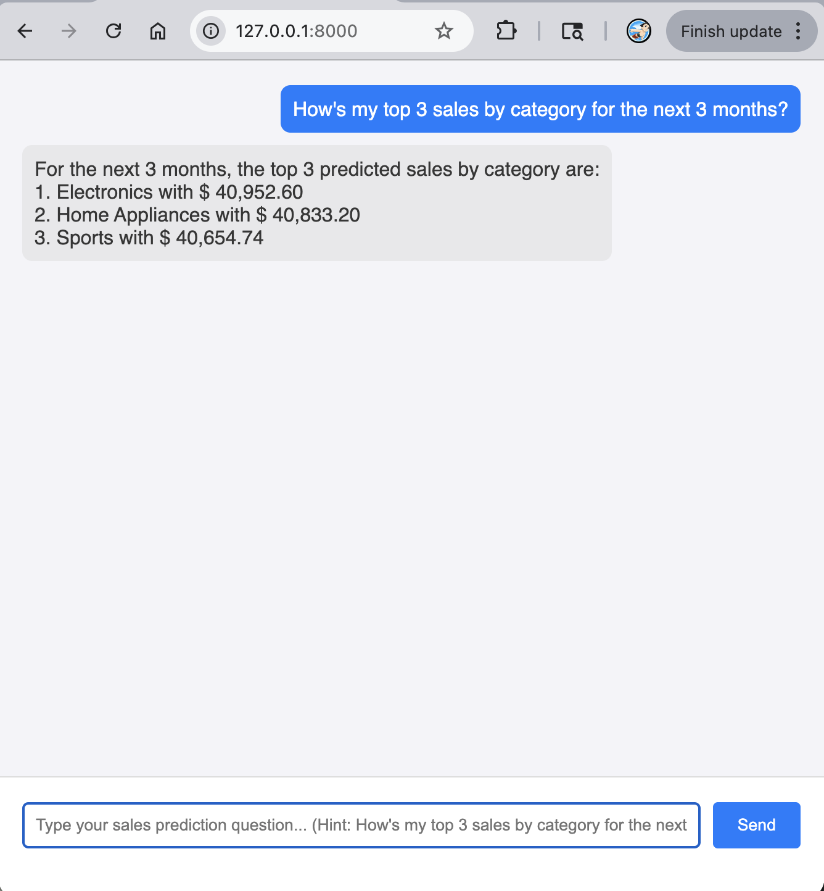
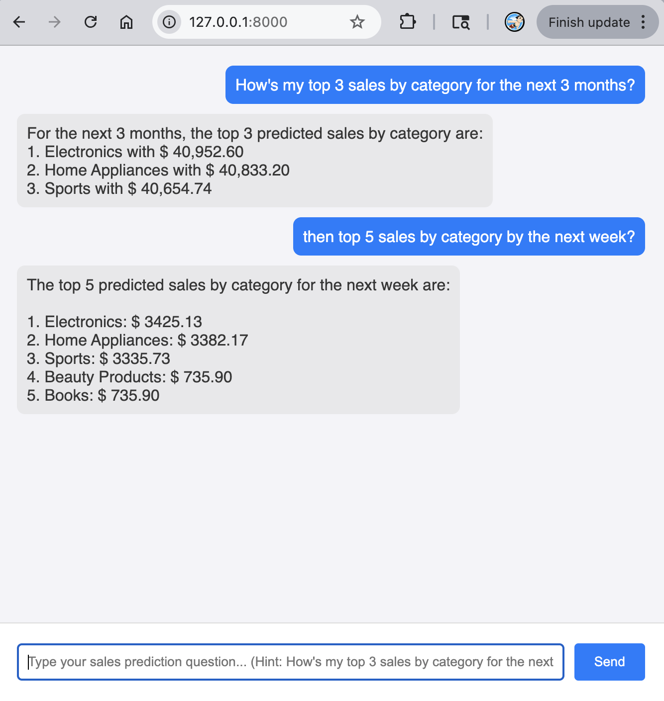
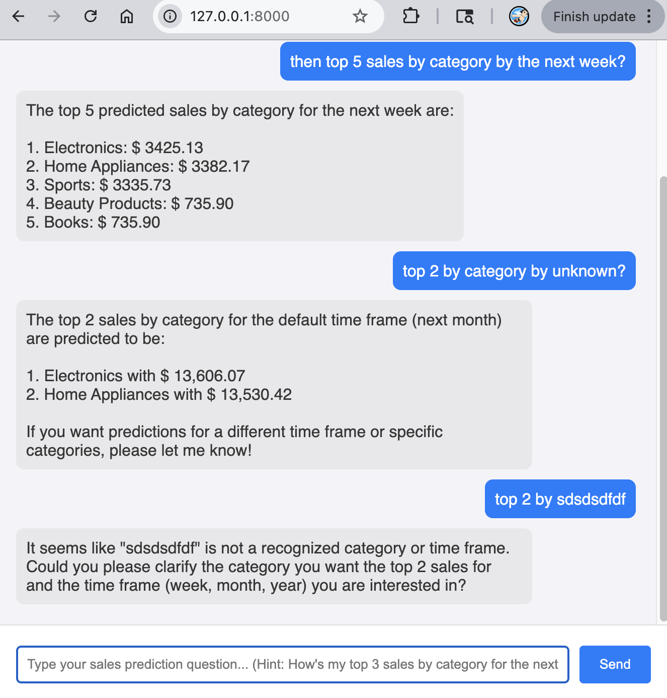

# craft-poc-model

A collection of Jupyter notebooks demonstrating an end-to-end ML pipeline for sales revenue forecasting — from raw data cleaning through feature engineering to model training and evaluation.

## Overview

This repository is the model development component of the [craft-poc](https://github.com/baechul/craft-poc) application. It covers:

- **Data cleaning & preprocessing** — Standardizing columns, handling missing values, deduplication, and type coercion
- **Feature engineering** — Temporal features (year, month, week, day of week) and lag features (1, 7, 14, 30-day revenue lags) aggregated at the `(date, product_category)` level
- **Model training & evaluation** — Comparing LightGBM and XGBoost regressors using MAE and RMSE metrics

## Notebooks

| Notebook                                                               | Description                                                                             |
| ---------------------------------------------------------------------- | --------------------------------------------------------------------------------------- |
| [`notebooks/rawdata-cleaning.ipynb`](notebooks/rawdata-cleaning.ipynb) | Loads `Online Sales Data.csv`, cleans and validates the data, and exports `sales.csv`   |
| [`notebooks/train-model.ipynb`](notebooks/train-model.ipynb)           | Builds the feature table, trains LightGBM and XGBoost models, and evaluates predictions |

## Tech Stack

- **Python** 3.14
- **pandas**, **numpy** — Data manipulation
- **scikit-learn** — Preprocessing (`LabelEncoder`) and evaluation metrics
- **LightGBM**, **XGBoost** — Gradient boosting regressors
- **uv** — Dependency and environment management

## Getting Started

```bash
git clone https://github.com/baechul/craft-poc-model.git
cd craft-poc-model
uv sync
uv run jupyter lab
```

> `uv sync` installs all dependencies from the locked `uv.lock` file, ensuring a reproducible environment.

## App Screenshots







## Related

- Demo application: [craft-poc](https://github.com/baechul/craft-poc)
